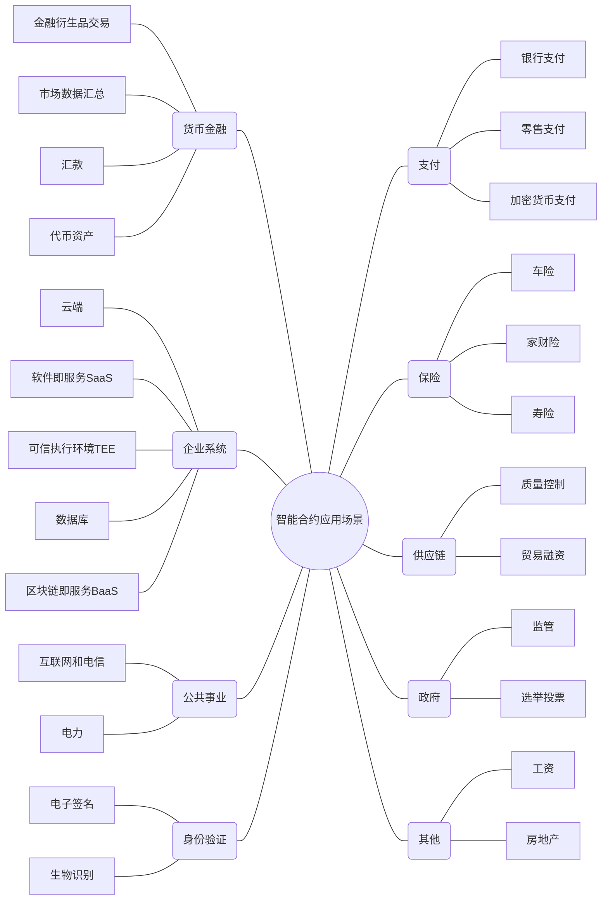
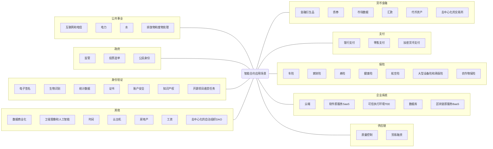
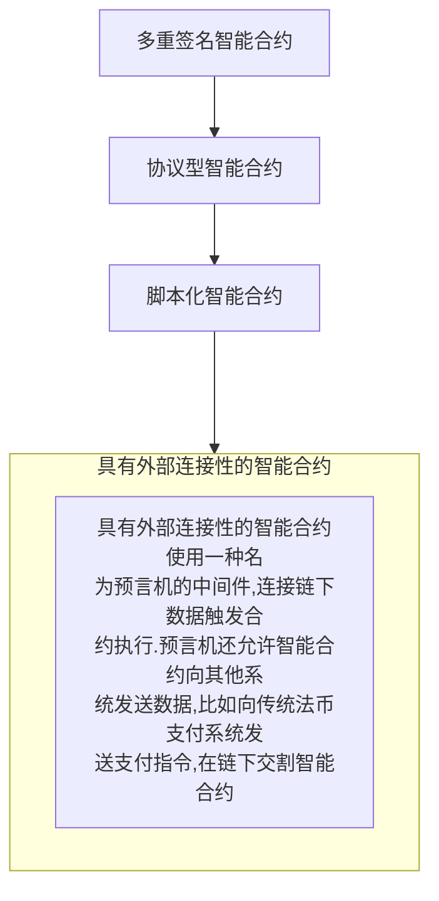
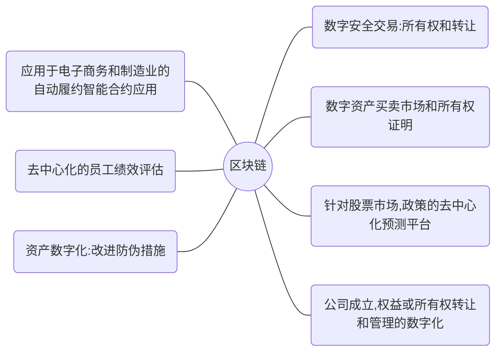
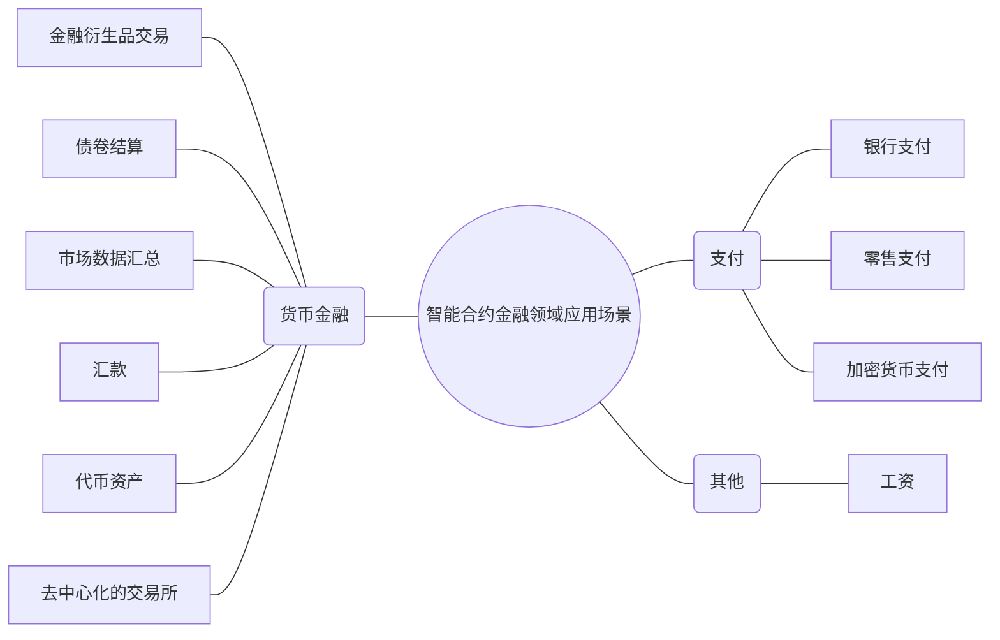
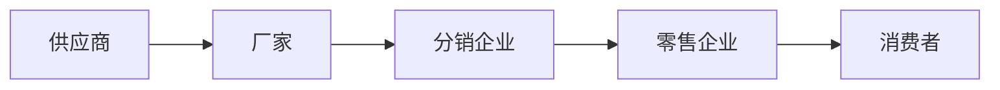
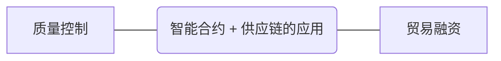
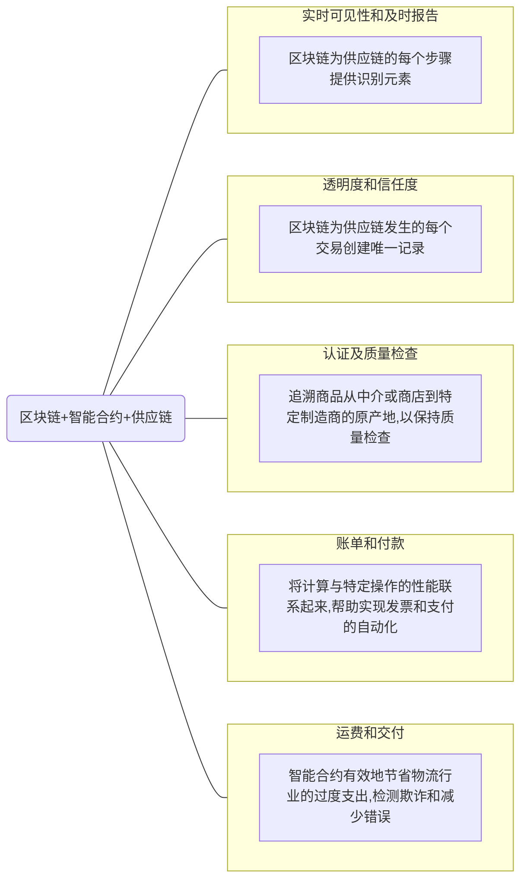
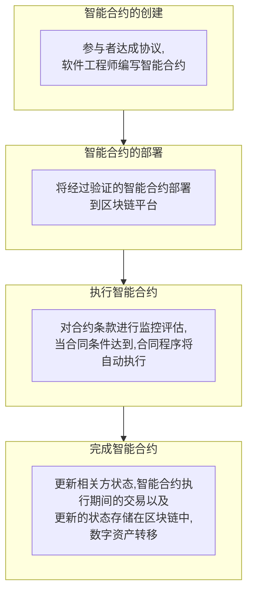

# 数字货币智能合约技术在供应链金融的应用

何总：内容是**数字货币智能合约技术在供应链金融的应用**

如果没有准确的，就是分别收集**供应链金融和智能合约**，整合出**两页ppt**，最好**明天**能出来

## 什么是智能合约？

数字合约是在互联网上运行的数字化签名合约，智能合约本身也是有一个数字协议，只是它在区块链上不可篡改的软件，严格按照约定的条款执行。

换成通俗的描述就是：智能合约是一个在计算机系统上，当一定条件被满足的情况下，可以被自动执行的合约

最简单的条件逻辑是：如果事件X发生，则执行行为Y

智能合约是高度确定的，也就是说合约百分之百会按照规定条款执行。智能合约之所以能分毫不差地执行，是因为它们所在的块链环境具有去中心化、无须许可、防篡改和永远在线特性。在这个框架下，合约是在中立的去中心化网络中运行，而且通过技术手段去保障执行

## 智能合约发展历程

具有外部连接性的智能合约使用一种名为预言机的中间件，连接链下数据触发合约执行。预言机还允许智能合约向其他系统发送数据，比如向传统法币支付系统发送支付指令，在链下交割智能合约

Chainlink预言机可以将数据（左边）发送至区块链上的智能合约（中间），并将支付指令发送至链下支付系统（右边）

## Chainlink

>Chainlink网络的工作流程

1. 第一步：在交易中调用客户端智能合约执行功能，功能实现需要外部数据。智能合约使用job ID准备发出请求，并设置任务参数。客户端智能合约调用预言机合约执行请求
2. 第二步：预言机合约发布事件（包含Job ID和参数，以及客户端合约承诺支付的LINK金额）
3. 第三步：所有连接到区块链网络的Chainlink节点都通过事件广播得知任务请求
4. 第四步：部署了Job ID的Chainlink节点得知自己已接受任务请求。将Job ID对应的任务内容与事件中的参数相结合，为任务执行设置环境
5. 第五步：收到所需数据后，Chainlink节点向预言机合约发出一笔交易，提醒任务已完成。交易信息包含任务执行结果
6. 第六步：预言机合约使用request ID查询请求方，并使用预言机结果数据触发请求方合约的回调

到这一步，客户端智能合约已经成功从链下获得了所需数据，并开始处理客户端发出的原始交易请求

## 智能合约的应用模式

### **权益管理（通证）**

通证合约的作用是创建、追踪和分配所有权。此类合约会在其通证中嵌入具体的功能，比如为通证持有者提供dApp服务/带宽（效用通证）、按权重在协议中投票（治理型通证）、分配公司股权（证券型通证）和实物资产或数字资产所有权（非同质化通证）等

### **金融领域（DeFi）**

去中心化金融（DeFi）应用使用智能合约再造传统金融产品和服务，其中包括货币市场、衍生品、稳定币、交易所以及资产管理等。智能合约可以托管用户资金，并根据结果分配给相应用户

智能合约应用于金融交易具有明显的天然优势，因为金融交易的本质就是价值转移，在金融交易中被交易的资产的本质决定了交易双方选择的协议。如果参与的交易的一方未按照双方协议的条框执行，合约的自动执行就不会启动，因此保护了遵守协议一方的权力

智能合约在金融领域的应用

>货币金融

货币是资产计价和交换中最常见的媒介。金融系统的核心就是最大限度地配置货币以增长财富。由于货币和金融价值重大，因此该领域的信任水平很低，人们往往会不计代价影响市场并逃避责任。智能合约可以通过建立去中心化的信任体系为金融行业带来确定性，消除现有金融体系中由于不确定因素而普遍存在的对手方风险。金融产品能够以去中心化的方式自动得到认证，避免中介从中施加影响并榨取价值

1.金融衍生品

- 金融衍生品合同基于标的物的价值，是公司对冲投资或交易风险的工具，如大宗商品或货币风险。Chainlink可从多个来源收集价格信息，整合数据，发送至智能合约，并发送支付数据进行结算，自动执行衍生品合约。市场中的公司通常直到建仓之前都会尽量拖延付款，因此使用Chainlink技术的智能合约非常有助于重建交易对手方之间的信任关系

2.债卷

- 先发债后偿还是短期融资的理想方式。债券合约可以编写成自动执行、无需信任且去中心化的智能合约。Chainlink可以用法币结算，同时也可消除对手方风险，因为各种去中心化认证的数据（如银行拆借利率）将自动触发付款。Chainlink之前已成功从五大银行收集利率数据，将其整合成智能合约使用的单一利率，并发送SWIFT付款信息进行利息支付，这证明了Chainlink有能力提供此项服务

3.市场数据

- 资产在不同交易所的挂牌价格不同，因此需要将多个来源的数据汇总，以得出一项资产的准确价格。Chainlink推出了多个开发者工具，以去中心化的方式无差别地获取最新且最可靠的价格。由于公司会基于资产价格交易价值几百万美元的资产，因此为了消除争议，资产价格的公正性、可靠性和防篡改性显得尤为重要。Chainlink已推出外部适配器，可以从CoinMarketCap， Brave New Coin， CryptoCompare，和Kaiko获得加密货币的市场数据

4.汇款

- 在全球化日益发展的今天，汇款业务随处可见。然而，汇款技术虽然先进，但这项业务不仅速度慢，价格也高。许多DLT项目都希望能在这个领域带来新的发展，而Chainlink的预言机可以为智能合约提供可靠的货币汇率数据，而且汇款后还能直接存入账户

5.代币资产

- 智能合约带来了代币资产的兴起，代币资产是现实世界中的资产在区块链上的化身。一个有意思的想法是建立一种代币资产，并通过Chainlink预言机将市场数据发送至智能合约，以此维持资产价格
- MakerDAO已经开始使用14个预言机为Maker系统建立参考价格。可以利用预言机针对黄金、石油或类似特别提款权的货币篮子（注：特别提款权是世界货币基金组织基于五种货币的加权平均值建立的国际储备资产）等代币资产开发一系列去中心化的产品

6.去中心化的交易所

- 大多数去中心化的交易所都要求用户在交易资产时必须关联钱包。然而，Chainlink却提供了一种新的方式，让智能合约可以访问交易双方的链下账户，即建立去中心化的交易所。在可信执行环境（TEE）中运行的预言机可以验证交易双方的身份认证，并在执行点对点交易前确定双方是否拥有合约中所约定的资产。Chainlink的预言机可将信息传递至智能合约，并确定合约执行

>支付

智能合约可以轻松使用区块链上的原生加密货币发起付款，比如以太坊上的智能合约用以太币发起付款。然而，许多公司的资产负债表无法承担加密货币的币值波动风险。另外，它们也不想浪费精力再将以太币兑换成法币。由于全世界存在各种支付形式，因此智能合约需要连接各种支付方案才能充分满足世界各地用户的需求

1.银行支付

- Chainlink可以让智能合约轻松访问现有银行系统，让开发者能够开发在传统金融系统中无法实现的应用程序。智能合约开发者可以无缝整合来自全球各大银行包括消费银行账户、直接存款和其他银行流程数据在内的所有数据。开发者还能利用国际支付信息标准SWIFT开发跨境支付功能

2.零售支付

- Uber和AirBnB等诸多受欢迎的消费型APP中，用户可以选择各种流行的零售支付方式。Chainlink让智能合约可访问主流信用卡提供商和成熟支付网络（如PayPal和Stripe）的数据，为智能合约用户提供同样的便利。开发者在开发应用时可以利用国内外时下最流行的零售支付方式。Chainlink已经为PayPal和Mistertango预编译了外部适配器

3.加密货币支付

- 加密货币越来越受到大家追捧，但大部分最流行的加密货币都无法与主流智能合约平台连接。Chainlink填补了这个空缺，让所有智能合约平台都可实现向任何分布式账簿发起付款。因此，智能合约可以实现用比特币、瑞波币、NANO币、稳定币或任何其他类型的数字资产发起付款

>其他

1.工资

- 利用物联网技术和员工打卡机上的生物数据，可以做到几乎实时向员工支付工资，员工可以按完成的服务或按服务的分钟数获得相应报酬。公司还可以先按预算规划支付员工工资，之后再按员工实际打卡数据修改工资数额。不仅如此，Chainlink预言机还可以将智能合约连接到员工指定的任意结算平台或去中心化交易所，这样员工就可以以任意币种结算工资，而公司也无须持有多种货币

### **供应链**

**供应链基本要素：**

供应链包含从采购原材料到向终端客户交付产品的整个过程。在这个过程中会发生多次付款、所有权变更以及各方共享文件的情况。智能合约可以彻底颠覆现有的审计模式，之前是靠人工盘点库存以确定财务报表的真实性，而现在则可以利用RFID芯片等技术在流程中自动验证每个模块的真实情况

1.质量控制

- 物联网传感器可验证产品真伪，并确保产品在整个供应链中完好无损，比如将食品保存在一定温度下，密封的容器不被中途开封，或者追踪货物的位置。智能合约可以基于物联网数据和合约中约定的质量控制标准触发赔偿和罚款

2.贸易融资

- 进出口企业通常会从银行获得融资以缓解流动性问题并解决交易中的信任问题。智能合约可以使用多种类型的数据提升贸易融资效率，如海运提单、GPS、RFID标签和海关数据。智能合约可以利用这些常见的参考数据决定是否支付全部或部分货款、转让所有权、或因为违约而要求退货。Chainlink已经为EasyPost的API开发了一个适配器，可获取海运数据

>区块链系统在供应链中的优势

**实时可见性和及时报告：**

区块链在供应链的每个步骤中都提供了一个识别元素，这样在最初阶段，错误就会显露出来，以便在必要时进行调整

**透明度和信任度：**

区块链帮助为供应链中发生的每个交易创建唯一的记录。信息和库存流被加密并记录在区块链分类帐中。这种分类帐可以帮助供应链经理立即了解供应商和零售商之间的交易历史。此外，它有助于消除传统记录的盲点，同时提高透明度，以改善各方之间的协调

**认证及质量检查：**

区块链允许追溯商品从中介或商店到特定制造商的原产地。每批货物都配有标签，确保数据的有效性。这些标签监控货物的位置和供应链各方之间的相互作用，以保持质量检查

**账单和付款：**

在供应链中使用区块链可以通过将计算与特定操作的性能联系起来，帮助实现发票和支付的自动化。此外，供应链中的区块链有助于减少文书工作或中介的需要，消除错误，防止欺诈，确保财务计算时间的准确性和合规性，并使流程更快

**运费和交付：**

区块链在供应链上的智能合约可以有效地节省物流行业的过度支出。这些智能合约将使业务流程和工作流自动化。区块链的分布式账本有助于减少交货时间。它还将检测欺诈和减少错误

>区块链在供应链中的实际应用

### **游戏：**

区块链游戏使用智能合约防游戏中欺诈行为。其中一个例子就是PoolTogether，这是一个保本储蓄游戏，用户将存款放在一个彩票智能合约中，并连接到货币市场。存款在货币市场中积累利息，并基于随机数生成机制（RNG）将利息发放给中奖者。公布中奖者后，所有人都可以取回最初的本金。同样地，智能合约还能用RNG创建罕见的游戏物品，比如一次性的神奇宝剑。可以用Chainlink的可验证随机函数（VRF）生成随机数，使用户相信结果的随机性，用户还能独立对结果进行验证，确保结果没有受到游戏开发者或数据提供商的操纵

### **保险：**

参数化保险是新型的保险模式，保险赔付直接与预先设定的具体事件挂钩。智能合约可以为参数化保险提供防篡改的基础架构，基于数据输入触发合约执行

## 智能合约的运行

## 智能合约语言(SCL)

|智能合约语言|描述|
|---|---|
|Solidity|一种编写智能合约的编程语言,在以太坊虚拟机上运行。它是一种面向合约的高级语言,其语法类似于JavaScript，主要针对以太坊EVM|
|Rust|区块链开发的最佳编程语言|
|Vyper|一种全新的以太坊开发语言,主要用于商用区块链,对区块链开发者来说可以提高安全性。语法上类似python|

[什么是智能合约？为什么它比传统数字合约更具优势？](https://segmentfault.com/a/1190000023220665)

[智能合约的48个应用场景介绍](https://blog.csdn.net/whatday/article/details/103804474)

[揭开Chainlink的神秘面纱](https://blog.csdn.net/ChainlinkO/article/details/105587681)

[供应链中的区块链应用前景](https://www.51cto.com/article/699770.html)

[区块链VS供应链，天生一对](https://www2.deloitte.com/cn/zh/pages/strategy-operations/articles/supply-chain-meets-block-chain.html)

[IBM 用于供应链解决方案的区块链](https://www.ibm.com/cn-zh/blockchain-supply-chain)

[太极链，资讯——智能供应链是一种自我感知的物联网环境](https://blog.csdn.net/weixin_33795743/article/details/91683742)

[第三极 供应链金融解决方案](https://tpblock.cn/solution-supply-chain-finance.html)