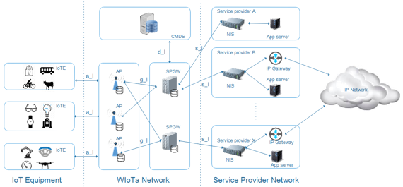

# WIoTa通信协议调研

> **任务要求**：
> wiota通讯方式是什么，介绍，利弊，安全性，哪里的标准，应用场景等
> **时间要求**：3.20-3.26
> **字数要求**：三四页材料

## 1. 简介

**技术简介**：

WIoTa(Wide-range Internet 0f Things communicAtion protocol) 协议，这是中国完全自主知识产权的，针对广域无线loT通信优化设计的通信协议，具有大覆盖、低功耗、大量连接、低成本等优势，提供统一的机制来适应更多不同无线应用场景的需求。

WIoTa通信协议针对IoT上行占比高，低功耗的特点，设计了深度优化的短消息通信模式，避免了传统通信协议中复杂的握手机制，降低了IoT的通信功耗。同时对物理层控制信道以及数据信道进行极简化设计，以减少开销和功耗。

WIoTa吸取蜂窝通信同步机制的性能优点，同时简化设计，做到成本效率的最优化。

WIoTa物理层调制方式采用自主设计的改进型（GMSK，支持标准GMSK的同时，支持高阶调制，具有高效的射频频谱效率，支持 1，2，3 bps per Hz的多级效率自适应（根据信道条件选择，提升系统容量），同时兼顾恒模相位调制(CPM)的特点，方便提高射频功率放大器效率。

WIoTa Preamble采用独特设计以避免在密集场景下自干扰的问题，同时支持10ppm低成本晶体。

**WIoTa网络架构**

## 2. 利弊

## 3. 安全性

加解密以及防恶意干扰

WIoTa协议结合自研基带芯片，支持极强的通信保密需求，包括：

- PUF物理不可克隆的密钥管理机制
- AES128数据和代码加密引擎

自研芯片加密引擎提供PUF、AES以及密钥管理功能。密钥在IoTE中不可读取，不可通过芯片克隆来复制。

IoTE与系统可以利用该密钥完成双向认证、数据加密密钥的动态更新。AP也可以在网络第一级将恶意终端排除掉，降低DDOS的危害。

## 4. 标准

## 5. 应用场景

WIoTa应用很广泛，适合几乎所有LPWAN的应用场景。从应用的角度来看，包含了To B和To C两个方向，To B主要应用场景有智慧养殖、智能表计、智慧农业、智慧能源、环境监测、工业物联网DTU等：TO C主要应用场景是智能家居（包括智能灯控、开关、门磁、和窗磁等） 、智能穿戴、语音对讲等。

### 智慧照明

智慧城市照明控制系统，包含智慧照明管理平台、WIoTa网关灯控、WIoTa单灯控制器、回路控制设备以及照明灯具等，通过软硬件协同和后台可视化管理的一套智能化城市照明管理体系。

## 引用

[御芯微WIoTa通信协议助力物联网行业新发展](https://mp.weixin.qq.com/s/AIzeb5iSMzkYsOGzaN6LCw)

[重磅发布 | 御芯微WIoTa通信协议简介及测试报告解读](https://mp.weixin.qq.com/s?__biz=Mzg4NDEwMDU2Ng==&mid=2247485001&idx=1&sn=4b24d3b1257f3004d600add601c0cd14&chksm=cfbc1af0f8cb93e607ef5c02ae78690e944e111522629daa229dc3ea438eb8c215394f9925a3&scene=21#wechat_redirect)

[《2022非蜂窝低功耗远距离物联网技术-市场研究报告（完整版）》](https://www.iotku.com/News/709062220457181184.html)

[全自主知识产权广域无线通信协议 WIoTa](https://www.elecfans.com/d/comp-5318905-136371326112915275776.html)

[全自主IP，价格减半……WIoTa助力LPWAN进入新时代](https://tele.ofweek.com/2022-11/ART-8320503-8110-30578727.html)

[首页- 御芯微](https://www.ucchip.com/)
