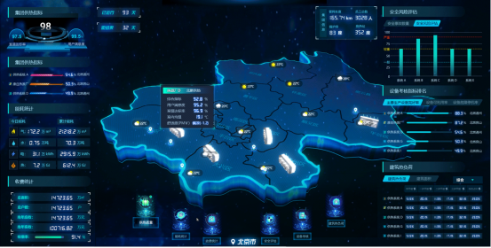
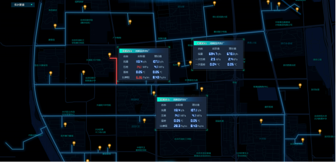
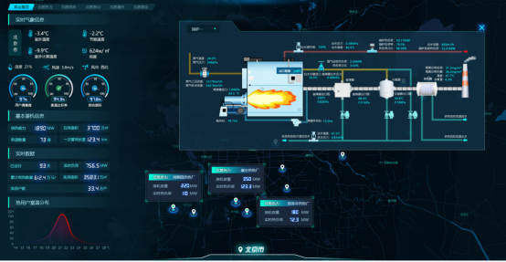
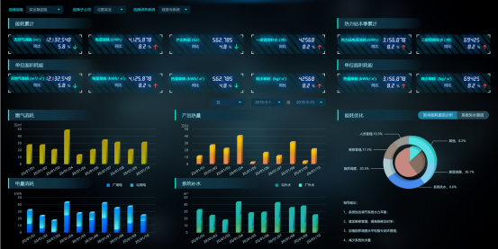
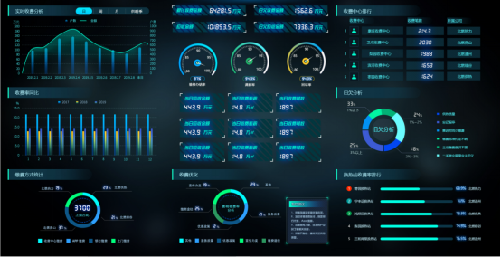
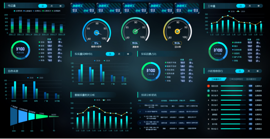
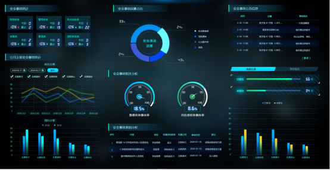

# 热计量+智慧供热

1. 热计量和智慧供热，是什么业务
2. 有什么业务机会
3. 两个业务三年业务发展规划

## 概念介绍

**热计量**：热计量（Heat Metering）是指测量热能消耗的过程，通常使用热表或热量计进行测量。热计量系统可以用来精确地计算出一个建筑物、单元或住户的热能消耗情况，从而帮助节约能源。（**不重要**）

**智慧供热**：智慧供热（Intelligent Heating）是一种利用现代技术和数字化方法改善供暖系统的方法。智慧供热系统通常包括传感器、控制器和管理软件，可以根据室内温度、外部气候、能源价格等因素进行动态调节。这样可以实现节能和舒适，同时也方便用户对供暖系统进行远程监控和控制。

## 热计量+智慧供热未来发展规划

在未来，热计量和智慧供热将继续发展和改进。预计以下是一些可能的趋势和发展规划：

热计量技术在未来可以期望得到更广泛的应用，特别是在城市化和节能减排方面。随着能源价格的上涨和环境保护意识的增强，人们对热能计量和利用的关注度将更高，因此热计量技术的发展将受到更多的推动。

智慧供热技术的发展也非常迅速，预计在未来几年内将有更多的智慧供热系统出现在市场上。智慧供热技术的发展将有助于提高供暖系统的效率和可靠性，并为用户提供更加方便和舒适的体验。同时，随着物联网技术的不断发展，智慧供热系统也有望与其他智能家居设备集成，形成更加智能和便捷的住宅环境。

总的来说，热计量和智慧供热技术的未来发展将受到市场需求和技术进步的推动，有望在能源节约和生活舒适方面发挥重要作用。

## 热计量+智慧供热市场机会

热计量技术的市场前景非常广阔，特别是在工业和商业环境中。随着对能源节约和节能减排的要求日益增强，热计量技术将得到更多的应用，从而为供应商带来更多的商机。

智慧供热技术的市场前景也非常广阔，特别是在住宅和商业环境中。随着消费者对更高效和更方便的供暖系统的需求不断增加，智慧供热技术将得到更广泛的应用，从而为供应商带来更多的商机。

此外，随着物联网技术的不断发展，智慧供热系统与其他智能家居设备的集成也将成为市场的重要趋势，为供应商提供了更多的商机。

总的来说，热计量和智慧供热市场具有巨大的机会，只需要抓住机会并充分利用，就能为供应商带来丰厚的回报。

## 材料升级

很不错，数据充分，超出预期。

这个材料最近在升级几次，不过时间不用紧了，争取一两周内。

需要增加的内容，

> 1、第7页，热力行业与碳中和这页右侧的三个文件能否找到原文

- [国务院办公厅关于全面推进城镇老旧小区改造工作的指导意见](http://www.gov.cn/zhengce/content/2020-07/20/content_5528320.htm)
- [国务院关于印发2030年前碳达峰行动方案的通知](http://www.gov.cn/zhengce/content/2021-10/26/content_5644984.htm)
- [国务院办公厅关于印发城市燃气管道等老化更新改造实施方案（2022—2025年）的通知](http://www.gov.cn/zhengce/zhengceku/2022-06/10/content_5695096.htm)

> 2、第2和11页这种驾驶舱图表有没有清晰度好，系统的版本可以指导我们软件开发功能和界面设计

1. **领导驾驶舱**

- 通过能耗分析、客服分析、经营分析、安全可靠性分析的建设，提供全方位、多视角、可视化的企业经营管理平台，为统一组织资源，辅助领导决策提供支撑，便于企业高层管理人员能及时、准确地把握和调整企业发展方向。
- 

2. **管网仿真**

- 建立供热管网仿真系统，对管网规划、设计、校核计算及仿真培训与运行调度分析。对于已存在的实际热网系统进行逼真地模拟以分析在各种工况下的运行状态和特性，如热负荷的变化、管道泄漏、天气变化等，从而为系统的安全和经济运行提供了指导性的建议。
- 

3. **生产分析**

- 帮助生产人员及时掌握供热系统热源、热力站、末端的运行工况，科学调整供热系统的运行方式，通过设备运行预警、设备异常报警、能耗异常等不同告警提示，及时发现运行异常，最终实现供热系统的节能降耗、经济、环保、安全可靠运行。
- 

4. **能耗分析**

- 对热源以及热力站的运行水平进行考核与管理，基于热网运行的水、电、气、热等能耗信息进行自动统计和分析，借助历史运行数据作为对比，持续优化节能方案，深入挖掘节能潜力，不断提高节能效益，从而全面实现节能目标。
- 

5. **收费分析**

- 梳理企业收费数据，采用大数据手段挖掘提高收费质量的途径，深度剖析供热指标、收费制度与收费率的关系，制定提高收费率的具体措施，达到员工高效收费、用户便捷缴费、领导轻松掌握收费动态，企业效益增加的目的。
- 

6. **客服分析**

- 基于对客服工单的统计，分析用户的工单类型、领导关心的投诉情况，对供暖运行水平及维修质量进行合理分析，从而提高客服响应速度、维修员工解决问题效率。
- 

7. **安全分析**

- 对危险源、安全隐患进行监控，及时监察、排查有问题的事项，包括监控一次管网泄漏预测、定位，管井安全，燃气泄漏监控，施工现场安全监控等。实现对涉安人员不安全行为和设备不安全状态，迅速、灵活、正确地理解（预测）和解决（启动安全设备或报警）。
- 

8. **报警分析**

- 建立报警管理模型，包含报警实时监控、报警统计分析、报警性能评估和报警变更管理功能，从而对系统的总体报警情况进行分析，帮助运维人员快速定位频繁的报警点位，从而保障安全生产。
- 

- [cloudiip 智慧供热云平台](https://www.cloudiip.com/html/1//149/225/711.html)

> 3、对8-9页等智慧供热和热计量市场分析能否形成表格，进行整体统计

√

> 4、第9泽智慧供热市场空间，左侧图时间周期是多少补充竞争对手分析，包括文中瑞纳智能

> 5、第11页智慧供热试点案例，顶秀金石，网上有没有问题分析

√

> 6、对第7、11页等，碳达峰、碳中和数据形成表格，进行系统分析

√

> 7、第12页，华为云方案能否找到更具体技术机构图等技术方案细节

√

> 8、经过对全文内容，数据等系统分析形成建议，智慧供热的市场机会具体在哪里？做温控器等物联网产品，还是做智慧供热系统软件，还是做相关服务？

有些问题，未必有准确答案，结合收集的信息和你的认识有哪些就写哪些。谢谢

> 还有智慧供热和热计量行业存在的问题是什么？

我看到有信息化水平落后、标准散乱、硬件设备规范性弱等，这就造成企业的产品和服务不容易形成规模化复制能力，收入和利润不容易快速增长，问题是这些吗，怎么应对？

√

让程总和投资人知道热力业务要不要继续做，团队打算怎么做，具体产品的业务抓手是什么预期做到什么前景和规模

[最新统计丨住建部：2021年末全国城市集中供热面积106.03亿平方米 同比增长7.30%](https://www.china-heating.org.cn/hangyesj/002221207.html)

[瑞纳智能 安华证卷 领航智慧供热，共赢“双碳”时代](https://pdf.dfcfw.com/pdf/H3_AP202112241536398429_1.pdf?1640336634000.pdf)

[智慧供热大市场：“内行”和“外行”玩家的较量](https://new.qq.com/rain/a/20220609A07U5U00)

[供热行业痼疾得解！他们用一朵智能的“云”做到了](https://t.cj.sina.com.cn/articles/view/7517400647/1c0126e4705901jlat)

[华为云携手哈尔滨太平供热，科技有温度，精算精控发挥每一份热的价值](https://www.huaweicloud.com/cases/tpgr.html)

[2022年供热行业发展现状及竞争格局分析 当前供热节能行业中的参与者多为中小企业](https://www.vzkoo.com/read/202201173a46c1df40f02dc2c3a499a0.html)

[智慧供热：老牌厂商加速构建护城河【附汇总表】](https://new.qq.com/rain/a/20220528A095DH00)

[智慧供热点燃千亿市场，全域协同未来可期](https://baijiahao.baidu.com/s?id=1746643311027832336&wfr=spider&for=pc)