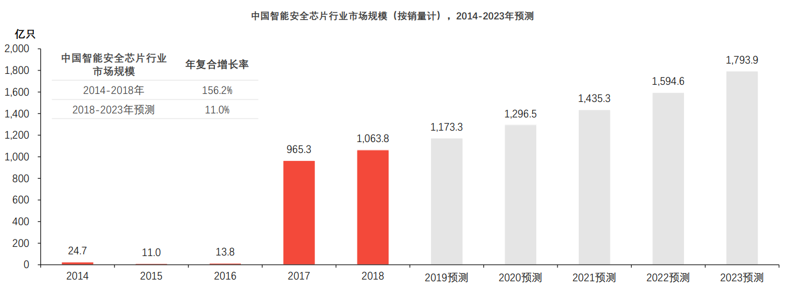

# 微控制器处理器及安全芯片市场调研
产品市场情况调研
1. 核内安全的产品
    - ARM网站有相关产品,可以参考ARM芯片SC000/SC300/M35P
    - sc000 ··· 银行卡 sc300 ··· POS机
2. SE安全芯片
   - 应用领域
   - 国际国内市场容量
   - 主要产品
   - 供应商
   - ......

## Cortex-M系列 微控制器处理器

防篡改微处理器用于存储和处理隐私或敏感信息,例如私钥或电子货币信息。为防止攻击者检索或修改信息,芯片被设计为不能从外部访问信息,只能由内部的嵌入式软件访问。嵌入式软件也应包含适当的安全措施。防篡改芯片包括所有安全加密处理器,例如智能卡中的芯片

Cortex-M: Microcontroller Processors(微控制器处理器)通常设计成面积很小和能效比很高。通常这些处理器的流水线很短,最高时钟频率很低。并且,新的Cortex-M处理器家族设计的非常容易使用。因此,ARM 微控制器处理器在**单片机和深度嵌入式系统**市场非常成功和受欢迎

||设计特点|系统特性|目标市场|
|---|---|---|---|
|微控制器处理器
|通常较短的流水线,**超低功耗**|内存保护单元(MPU),嵌套向量中中断控制器(NYIC),唤醒中断控制器(WIC),最新ARM TrustZone®安全拓展|微控制器,深度嵌入系统(eg:传感器,MEMS,混合信号IC,IoT,家电,便携式低功耗设备)

### 基于Cortex-M处理器的产品开发
Cortex-M处理器家族包含各种产品来满足不同的需求:

>Cortex-M系列处理器容易使用

为了实现更容易的软件开发,更好的软件重用性和可移植性,ARM开发了CMSIS-CORE,CMSIS-CORE通过一组APIs为处理器的各种特性像终端管理控制提供了一个标准的硬件抽象层(HAL), CMSIS-CORE集成在各种微处理器厂商提供的设备驱动程序库里,被各种开发工具套件支持

除了CMSIS-CORE, CMSIS还包含一个DSP软件库(CMSIS-DSP)。这个库提供了为Cortex-M4 和 Cortex-M7优化过的各种DSP函数,当然也支持其他的Cortex-M系列处理器。CMSIS-CORE 和 CMSIS-DSP库都是免费的,可以从GitHub (CMSIS 4, CMSIS 5)下载到,并被许多工具厂商支持

>生态系统

使用ARM Cortex-M系列处理器的关键优势之一是广泛的成熟设备,开发工具链和软件库的支持。目前有
1. 超过15家微控制器厂商正在销售基于ARM Cortex-M系列内核的微控制器产品
2. 超过10种开发套件支持ARM Cortex-M系列处理器
3. 40多家操作系统厂商的操作系统支持Cortex-M系列处理器

### 可用于智能卡和嵌入式安全应用的Arm SecurCore系列

Arm SecurCore处理器设计具有防篡改功能,基于行业领先的ARM架构提供32位安全解决方案,通过各种安全功能来加强ARM处理器,可用于智能卡和嵌入式安全应用

>智能卡主要应用:
- SIM
- 银行业
- 付费电视
- 公共交通
- 电子政务
- ID

[请求更多信息](https://www.arm.com/company/contact-us)

SecurCore系列包括SC000、SC100和SC300处理器
|SC000|SC300|
|---|---|
|只占用8/16位的空间但却拥有32位的性能|高性能
|具有卓越的能效表现|高功效
|超低功耗|
|容易配置|容易配置
|向上兼容二进制的SC300处理器|适用于对安全性和性能要求较高的高端应用
|基于Cortex-M0|基于Cortex-M3

#### SC000 处理器

ARM SecurCore SC000处理器基于Cortex-M0,专为最高容量的智能卡和嵌入式安全应用而设计。目标应用扩大至防窜改接触式(tamper-resistabt contact)及非接触式智能卡,如SIM卡、政府事务、**银行**、运输、身分识别及限制存取系统

据统计,截至2021年末,发卡方面,银行卡累计**发卡量92.5亿张**,当年**新增发卡量2.7亿张**,同比增长3.0%。其中,借记卡84.47亿张,同比增长3.30%；信用卡和借贷合一卡8亿张,同比增长2.85%。人均持有银行卡6.55张,其中,人均持有信用卡和借贷合一卡0.57张

ARM公司处理器部门营销副总裁Eric Schorn表示,“智能卡正被用于越来越广泛的应用之中,而这些应用有着不同的系统需求和价位;同时,为了减少成本及产品上市时间,行业也要求标准化。可配置性极高的SC000处理器因其前所未有的小尺寸、低成本和低功耗完美地满足了这些需求。”

SC000处理器具备的高度可配置的特性使得供应商能够容易地针对不同的智能卡应用设计多样化的安全器件,同时保持与高端SC300处理器的兼容性,便于向更高性能和安全性应用的移植

#### SC300 处理器
ARM SecurCore SC300处理器基于Cortex-M3,特别为非接触式及USB智能卡及嵌入式安全应用而设计。该处理器能够将更多的功能嵌入智能卡或SIM卡,同时将所需的额外芯片面积最小化。此外,SC300处理器还具有快速实时处理多接口的性能,可用于全新的高速和非接触式应用,包括智能卡网络服务器（SWCS）和近距离无线通信（NFC）

SC300安全核处理器可应用于简易POS机等其他有二维码扫码和对功耗及成本敏感的金融安全设备,在提供高性能的同时,还提供安全、节能的解决方案

相比传统的POS机,智能POS机的功能更多,更便捷。传统的POS机仅仅支持银联卡刷卡交易,但并不支持现在大多数消费者的使用的二维码支付、Apple Pay等方式

随着银行卡渗透率的提升,居民消费习惯越加依赖POS终端交易,商业银行利益推动,较大的潜在商户规模以及传统POS机终端存量更换需求都推动着智能POS终端持续增长。2015年,我国智能POS机出货量仅9万台,2020年行业出货量达到1500万台,2015-2020年期间年均复合增速高达8.21%

>mPOS终端机

mPOS: 新型支付产品,与手机、平板电脑等通用智能移动设备进行连接,通过互联网进行信息传输,外接设备完成卡片读取、PIN输入、数据加解密、提示信息显示等操作,从而实现支付功能的应用

互联网、移动支付、大数据等新技术和新应用模式的出现,催生出众多新型支付方式,mPOS作为其中代表性的一员,具备高性能、高安全、稳定便携的特点,成为越来越多商户的首选方式。

mPOS支付主要通过手机内手机卡实现,通过SIM卡代替常规IC卡的功能,首先用户通过手机内的SIM卡在读写器中读卡,读写器通过识别将信息传入mPOS终端机,mPOS终端机将数据发送到管理服务器内进行核实对比以及数据的交换处理,最终将数据传回到mPOS终端机以实现消费功能

## SE安全芯片

>简介

SE为安全模块,是一台微型计算机,通过安全芯片和芯片操作系统(COS)实现数据安全存储、加解密运算等功能。SE可封装成各种形式,常见的有智能卡和嵌入式安全模块(eSE)等。针对NFC终端产品开发的嵌入式安全模块（eSE）产品,采用满足CCEAL5+安全等级要求的智能安全芯片, 内置安全操作系统,满足终端的安全密钥存储、数据加密服务等需求。可广泛应用于金融、移动支付、城市交通、医疗、零售等领域,既能保护线上支付的安全,又能配合NFC作为线下支付的钱包使用

SE支持的安全算法分为国际算法(RSA\ECC\DES\3DES\AES\SHA-n)和国密算法(SM1\SM2\SM3\SM4\SM9),SE的安全资质包括EAL4+、国密二级等

>性能

SE在安全体系里主要功能包括:密钥的安全存储、数据加密运算和信息的安全存放。密钥的安全存储可建立相对完善的密钥管理体系,保证密钥不可被读取。数据加密运算包括对于可靠的安全算法的支持、敏感数据密文传输和数据传输防篡改等。信息安全存放指的是严格的文件访问权限机制和可靠的认证算法和流程

>应用领域

- 银行卡: 将SE镶嵌在塑料卡基上,封装成卡片,卡片尺寸遵循行业标准,如金融IC卡、SIM卡等
- 异性卡: 封装成各种移动支付卡,和尺寸个性化的异形卡
- 各类终端产品(手机、iPad等): 封装成各类嵌入式模块,内置于各类终端产品中

>智能卡芯片

卡内的集成电路中带有微处理器CPU、存储单元(包括随机存储器RAM、程序存储器ROM(FLASH)、用户数据存储器EEPROM)以及芯片操作系统COS。装有COS的智能卡相当于一台微型计算机,不仅具有数据存储功能,同时具有命令处理和数据安全保护等功能。智能卡可适用于金融、保险、交警、政府行业多个领域,具有用户空间大、读取速度快、支持一卡多用等特点,并已经通过中国人民银行和国家商秘委的认证

>国内外主流安全芯片企业动态及发展趋势

安全芯片在国外的应用已有近二十年的历史,欧洲拥有ST、英飞凌以及NXP等安全芯片厂商,推动了安全芯片产业的发展

ST(意法半导体)为智能卡和委托产品应用领域,连同广泛的高速产品系列、可共同使用的片上操作系统(SoC)解决方案提供了完整的安全微控制器和存储器。产品广泛应用于各类智能卡使用场景,从最简单的电话卡到要求最严格的SIM与Pay-TV卡

英飞凌致力于高能效、移动性和安全性的科技挖掘,为汽车和工业功率器件、芯片卡和安全应用提供半导体和系统解决方案,并在模拟和混合信号、射频、功率以及嵌入式控制装置领域掌握尖端技术

NXP(恩智浦半导体)主要提供各种半导体产品与软件,为移动通信、消费类电子、安全应用、非接触式付费与连线,以及车内娱乐与网络等产品带来更优质的感知体验

中国安全芯片从电信IC卡起步,经历身份证卡、社保卡、金融IC卡,已经与国际领先企业在安全认证领域比肩

中国智能安全芯片行业产业链由上游晶圆厂、封测厂、模组生产商组成,中游为智能安全芯片厂商,下游市场参与者智能卡制卡商及发卡机构组成

国内的安全芯片行业,由于涉及国家安全,国家政策倾向带国密算法的产品。国内具有带国密算法安全芯片厂商主要有:华大电子、**华弘集成**、大唐微电子、同方微电子、天津国芯、国民技术、复旦微电子公司。而智能卡成卡供应商则数量众多,主要有握奇数据、东信和平、**华弘**、华大、恒宝、明华公司等企业

中国智能安全芯片商在超级SIM领域已经有了技术进展,5G超级SIM相比于前四代以KB为单位的容量级别,超级SIM卡的容量扩大了数十万倍,实现了颠覆性突破。5G超级SIM卡以超大容量、一键换机和安全存储为三大亮点。目前由紫电国微自主研发的超级SIM芯片,已经取得国际CC EAL6+、ISCCC EAL4+、银联芯片安全认证、国密算法二级认证等权威资质,是当前世界上安全等级最高的芯片之一

|供应商|主要产品|应用领域|
|---|---|---|
|紫光同芯
|THC80
|物联网设备|
|紫光同芯|THK88|物联网设备|
|紫光同芯|THD89|物联网设备|
|华大电子|CIU98_A|智能门锁、智能家居、智能表计等|
|华大电子|CIU98_B|移动支付、安全SE、手机ese、TBOX SE等|
|华大电子|CIU98_C|智能家居、智能表计等|
|华大电子|CIU98_E|高速公路OBE-SAM等|
|复旦微电子|FMSE|国六TBox、车载中控、表计|
|复旦微电子|FM1230|国六TBox、车载中控、无线充、表计、配件认证、耗材防伪、防抄板、版权保护|
|复旦微电子|FM1231|防抄板、版权保护|
|复旦微电子|FM151M|SWP SIM、PSAM卡、SE、数字钥匙|
|国民技术|Z8/Z32/N32S|数字货币、二维码支付、耗材认证、设备身份认证|
|国民技术|Z8D16R-2|挑战型动态令牌、按键型动态令牌、常显型动态令牌|
|国民技术|NS3300|智能家居家电、电池防伪、设备身份认证、耗材认证|
|国民技术|Z32H330TC|可信计算|
|国民技术|Z32HM|安全SIM卡、eSE、支付模块、区块链冷钱包|
|国民技术|Z32HCD2/2S|社保卡、银行卡、残联卡、电子工商执照、交通卡、旅行证件|
|天津国芯|CUni360S-Z|POS机、双界面读卡器、动态二维码终端等|
|天津国芯|CUni350S|网上银行、身份识别、移动支付、数据安全、保密通信和智能仪表等|
|天津国芯| A5(ET300)|加密手机、网上银行、移动支付、数据安全、版权控制和智能电网等|
|天津国芯|CCM3310S-T|智能密码钥匙、智能卡、读卡器、加密板卡、网上银行、视频监控、移动支付、数据安全、版权控制、车载设备、物联网、智能电网和汽车电子等|
|天津国芯|CCM3202S|移动支付、CMMB及数据加密应用等|

>中国智能安全芯片市场规模

随着中国EMV迁移的不断深入,中国非接触式智能芯片的终端识别环境将得到不断完善,市场潜力巨大数据显示,非接触式智能卡芯片市场在2017年急剧增长,销量达到678.0亿只。这使得在过去五年中,中国智能安全芯片行业市场规模（按销量计）以156.2%的年复合增长率从迅速从24.7亿只增长至1,036.8亿只。2019年是5G元年,未来5年随着5G硬件终端的普及,RFID技术将被广泛应用于交通、日常消费、公共服务等多方面,市场潜力巨大。同时,IC卡在中国的应用范围将进一步扩大,渗透率也将在现有基础上进一步提高。预计未来五年,中国智能安全芯片行业市场规模将在现有基础上保持稳定增长的态势,预计到2023年,中国智能安全芯片行业市场规模（以销量计）将以11.0%的年复合增长率增长至1,793.9亿只

非接触式读写器芯片市场增速快,潜力大。非接触读写器芯片应用了射频识别技术（RFID）,广泛应用于门禁、酒店门锁、交通一卡通、金融 POS 机中,是数字化管理、小额支付、金融交易不可或缺的元素。随着中国EMV迁移的不断深入,非接触式智能卡芯片市场在2017年急剧增长销量达到678亿只。随着5G时代的来临,RFID技术将被广泛应用于交通、日常消费等方面,其市场潜力巨大

>中国智能安全芯片行业驱动因素

IC卡将逐步替代磁条卡,成为未来发展趋势。IC卡广泛应用于电信SIM卡、移动支付、居民健康卡、金融IC卡、社保卡、城市一卡通等。通过卡内的集成电路存储信息,IC卡具有更好的保密性与更大的储存容量,可实现更多功能。IC卡的多功能应用将是未来智能卡技术发展的方向。政策推动IC卡的快速应用和加速渗透,发卡量逐年上升。人民银行、人社部和交通运输部出台了支持金融IC卡的政策,全面推动磁条卡向金融IC卡迁移。中国金融IC卡产业发展迅速,IC卡发卡量逐年稳步上升,整体发展态势良好,IC卡芯片的市场规模增长迅速,从2018年95.9亿元,增长至2021年的117亿元,复合增速为6.9%

