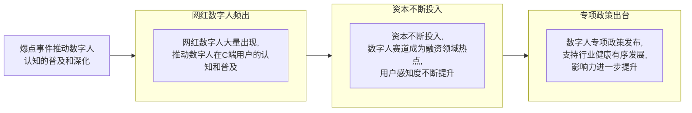
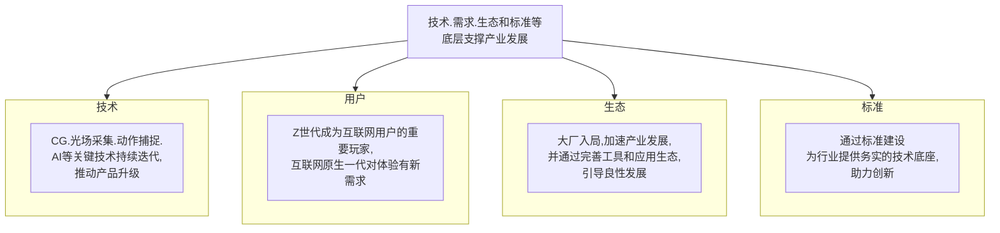
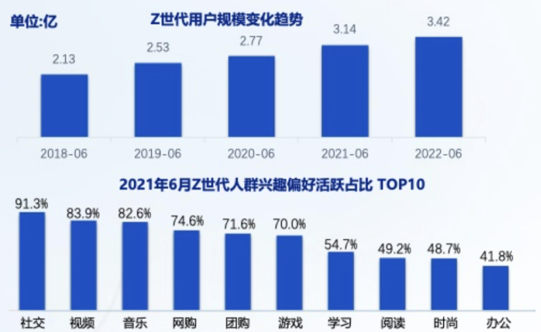
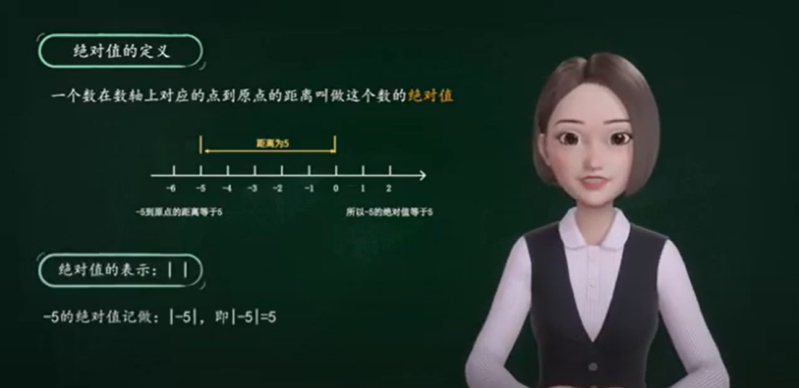
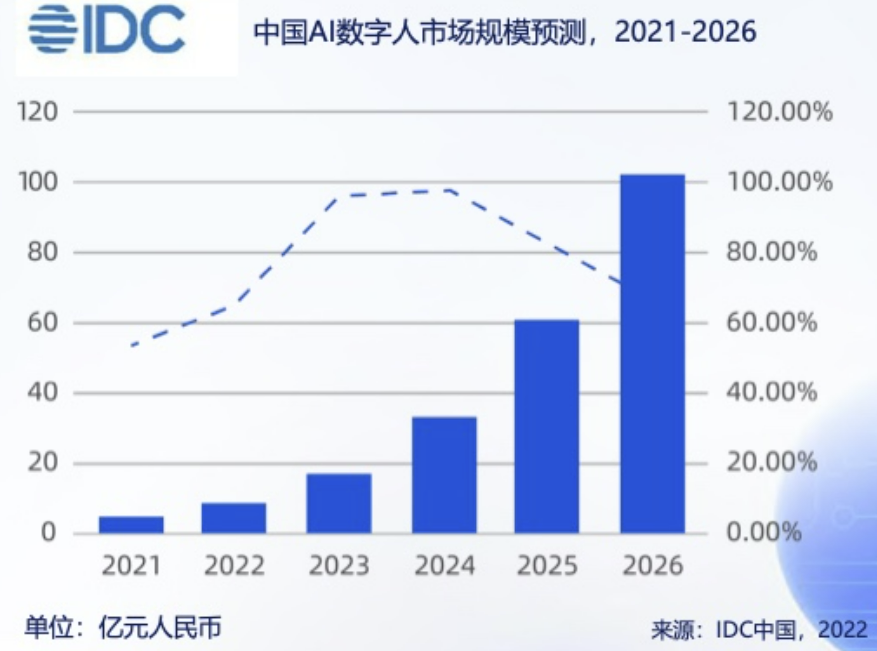
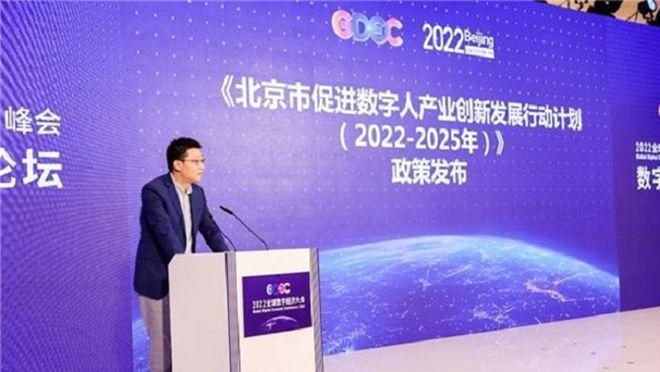

# 虚拟数字人

## 数字人介绍

数字人是指以数字形式存在于数字空间中，具有拟人或真人的外貌、行为和特点的虚拟人物，也称之为虚拟形象、虚拟数字人等。数字人的核心技术主要包括计算机图形学、动作捕捉、图像渲染、AI等

数字人可以打造更完美的人设，为品牌带来正向价值。互联网、金融、电商平台、消费品牌、汽车出行等领域纷纷推出数字人，用于品牌营销、**智能客服**等方向

## 数字人发展因素

Z世代用户增长速度较快，规模已达3.42亿，已成为互联网的重度用户，他们对社交、视频、音乐、网购等兴趣爱好使用深度及广度上遥遥领先于全网平均水平

Z世代对新形式互联网产品需求更大，而数字人突出人物个性，强调体验及交互性，与Z世代用户可以产生情感链接，并产生情绪共振和文化认同，特别是数字人和虚拟空间相结合，孵化新玩法，带来新体验，因此Z世代用户为数字人的核心用户群体

进入2022年以来，数字人在诸多场景中大放光彩，特别是在北京冬奥会的开幕表演、气象播报、手语解说中频频现身，使其用户基础不断扩大

*Z世代：通常指1995年及后出生的一代人

## 数字人发展现状

头部企业通过打造数字人制作工具和平台、数字人应用平台等引领产业快速发展

腾讯小微数智人：购买服务包后，可以获得腾讯云智能数智人平台-交互数智人模块的aPaaS接口授权。通过调用该接口，可获得一路实时视频推流服务。可以访问交互数智人平台创建一个数智人项目，进行简单的数智人形象设置后，就可以通过“接入管理”模块获取密钥信息和接口文档；可轻松对接aPaaS接口，拉取视频流集成到应用场景

厦门黑镜科技有限公司认为，在需求尚未发掘的B端市场，数字人已经具备解决若干问题的能力，比如制作基于数字人的企业内容、虚拟员工等。

黑镜科技将数字人技术应用到企业SaaS服务上，利用自身的全栈虚拟化技术，帮助企业低成本、低门槛地创建数字人，并用这些数字人进一步创作虚拟内容，服务企业的新闻发布、培训、销售等需求，降低虚拟人力成本

黑镜科技推出了完全云原生、无代码前端的数字人生产及内容创建工具MetaMaker ，实现了“一站式”与“一键式”的自动化操作

黑镜科技创始人、董事长陈军宏透露，目前黑镜科技的产品和技术已经获得了爱奇艺、科大讯飞、一汽奔腾、新氧、中国经济网等客户

## 数字人应用场景

1. **虚拟教师：** 生成虚拟教师形象，植入在线教育类APP，可为学生提供授课服务，降低教育机构教学内容生产成本

[虚拟数字人老师](https://www.youtube.com/watch?v=Q_GL8KwXhTo)
1. **虚拟助手：** 在音乐播放、天气查询等智能助手场景中，在语音助手基础上植入数字人虚拟形象，为用户提供更便捷和自然的服务体验

[从33款虚拟数字人，浅析虚拟数字人的应用前景](https://www.niaogebiji.com/article-109651-1.html)
1. **虚拟讲解员：** 在游戏直播、旅游景区、博物馆等场景，借助虚拟讲解员提供游戏解说、景区导览、历史文物讲解等服务

1. **虚拟偶像：** 通过绘画、动画、CG等形式制作，在因特网等虚拟场景或现实场景进行歌手活动，“虚拟偶像”本身并不是以实体形式存在，而是通过全息技术完成网络空间与现实空间的互动

## 华为HMS ML Kit数字人

### 简介

HMS ML Kit数字人是依托华为图像处理、语音合成、声音克隆、语义理解等AI核心技术，推出的综合多模态AI能力。面向教育、新闻、多媒体制作企业，提供高质量、低成本、创新体验的内容创作模式

### HMS ML Kit数字人服务集成过程

1. 提交需要生成的文本信息
    - 调用**定制文本转虚拟数字人视频接口**，将一些配置（config）和需要转化的文本（data）通过该接口传输至后端进行处理：首先，要对传输进来的data的文本字符长度进行校验，中文文本最大字符长度不得超过1000，英文文本单个字符长度不得超过3000，英文文本单词长度不得超过3000，对于传输进来的config做非空校验，然后将config和data提交，将文本文字转化为音频文件
2. 异步执行的定时任务
    - 会有一个异步执行的定时任务处理提交的数据，调用TTS提供的算法，将文本文件转化为视频文件，并且将上一步得到的音频文件与视频文件合成起来
3. 查询文本是否转化成功
    - 调用**文本转虚拟数字人视频结果查询接口**，实时查询异步执行的文本转视频是否已经执行完毕；如果执行完毕，将会返回一个生成视频的链接
4. 根据视频链接访问视频文件
    - 根据**文本转虚拟数字人视频结果查询接口**所返回的视频链接，访问生成的视频文件

### HMS ML Kit数字人服务实现的主要功能

1. **双语发音**：由于目前系统支持中文发音和英文发音，可以传输中文文本和英文文本作为发音数据
2. **多个虚拟主播形象**：支持不同虚拟主播发音，目前系统里配置了4名虚拟主播，分别为：中文女士发音，上海日报，英文女士发音，英文男士发音
3. **画中画视频播放**：除了对虚拟主播的设置以外，视频播放支持画中画即小窗播放视频，在画中画模式播放视频时，视频窗口随屏幕移动，可以一边查看文本，一边播放视频，视频窗口还可以拖拽到任意位置，以至于不遮挡文本位置

4. **可调节的语速，音量，音调**：可以满足不同需求的发音速度，发音音量以及发音音调
5. **多背景设置**：可以设置不同的虚拟主播背景，目前系统内置了透明背景、绿幕、科技主题三种背景，还可以通过上传图片的方式自定义自己喜欢的背景进行设置
6. **字幕设置**：系统可以自动配置字幕，可以设置中文字幕，英文字幕或者双语字幕
7. **多布局设置**：可以由参数调节虚拟主播出现在屏幕当中的位置：左测，右侧，屏幕中间；以及调节虚拟主播人物大小和展示全身或半身。在选择虚拟主播出现在屏幕当中的位置为左边或者右边的时候，还可以设置台标和台标出现的位置，以及在视频当中显示需要播放的视频文件，做到视频画中画的效果，以还原真实的新闻播报的场景

## 前景

数字人市场增长迅猛，市场分析机构预测，AI数字人市场规模在2026年将达到102.4亿元

国投美亚基金投资副总裁杨天蔚认为数字人在阶段鲜有商用的核心原因，是目前大部分的企业数据智能化的能力尚还处于建立的阶段，且数字人的技术落地依然是高度定制化，应用落地存在相当高的门槛。"也就冬奥会这样级别的场景才有这个预算，数字人背后都是经费在燃烧。"

数字人的未来具有很大市场空间，但如果从加德纳技术成熟度曲线（Gartner Hype Cycle）来看，数字人目前仍处在快速成长的爆发期，离真正的成熟还有很长的距离要走。"数字人背后的基础技术要达到普惠级别，才会趟过破灭期进入平稳发展期。"

数字人诞生之后还要靠大量的数据来"喂养"，才能逐渐完善为一个逼真的人设，具备对外输出形象和服务的能力，这就要求企业需要具备数据治理以及数据智能化的能力。

杨天蔚说："数字人未来就是企业的'Jarvis'，数字人对数据安全也会提出更高的要求，万一数字人被劫持绑架了呢？"

## 政策

**北京发布首个数字人产业政策：**

2022年7月，在2022全球数字经济大会上，北京市发布了《北京市促进数字人产业创新发展行动计划（2022-2025年）》，该计划是国内出台的首个数字人产业专项支持政策，从构建数字人全链条技术体系、培育标杆应用项目、优化数字人产业生态等方面为支持数字人产业发展提供了指引，进一步加深数字人在用户中的认知

根据《行动计划》，到2025年，北京市数字人产业规模将突破500亿元，培育1-2家营收超50亿元的头部数字人企业、10家营收超10亿元的重点数字人企业。初步形成具有互联网3.0特征的技术体系、商业模式和治理机制，成为全国数字人产业创新高地

## 引用

[一文搞懂华为ML Kit数字人，超简单集成](https://segmentfault.com/a/1190000037697010)

[国内首个虚拟文物解说员“文夭夭”上岗：将服务各大博物馆讲国宝](https://finance.sina.com.cn/tech/2022-05-18/doc-imcwiwst8070394.shtml?finpagefr=p_114)

[腾讯研究院：2023数字人产业发展趋势报告](https://finance.sina.com.cn/tech/roll/2022-12-13/doc-imxwncsc2312227.shtml)

[北京市促进数字人产业创新发展行动计划（2022-2025 年）](http://www.beijing.gov.cn/zhengce/zhengcefagui/202208/W020220808406785112297.pdf)

[亮相冬奥会完成全民科普，风口飞了一年的数字人如何照进现实](https://m.thepaper.cn/baijiahao_16750596)

[冬奥数字人频亮相，MetaMaker 加码数字人新赛道](https://www.metamaker.cn/#/newsContent?newsIndex=2)
