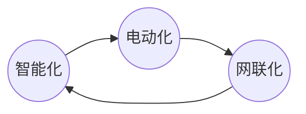

# 车规级MCU市场调研

## 车规认证
1. ISO/TS16949
- 全名:质量管理体系-汽车行业生产件与相关服务件的组织实施 ISO9001：2000 的特殊要求
- 定义:本质是一套**零失效(Zero Defect)**的供应链品质管理标准体系
- 行业地位:是判断一家芯片原厂是否具有车规级芯片设计、生产流程管控能力的标志
2. AEC-Q100
- AEC:Automotive Electronics Council:汽车电子协会
- 行业地位：是判断芯片产品是否具备车用资格的标志之一，侧重质量可靠性
3. ISO26262
- ISO26262 是从电子、电气及可编程器件功能安全基本标准 IEC61508 派生出来
- 定义：ISO26262是针对汽车电子的功能安全标准。等级从低到高：
    - ASIL(Automotive Safety Integration Level，汽车安全完整性等级)
    - ASIL-A级芯片可应用于天窗控制
    - ASIL-B级芯片可应用于仪表盘显示
    - ASIL-C 级芯片可应用于引擎控制
    - ASIL-D级芯片可应用于自动驾驶、EPS（电动助力转向系统）
- 行业地位：是判断芯片产品是否具备车用资格的标志之一，侧重功能安全性

## 已实现车规级MCU批量生产的厂商已实现车规级MCU批量生产的厂商
|序号|企业名称|应用领域|首款通过时间|
|---|---|---|---|
|1|四维图新:杰发科技|ABS、BMS等核心功能|2018年|
|2|比亚迪半导体|车规级触控MCU、车规级通用MCU以及电池管理MCU|2018年|
|3|国芯科技|车载T-BOX安全单元、车载诊断系统安全单元、车联网C-V2X通信安全单元、车联网C-V2X通信安全应用|2019年|
|4|芯海科技|车身电子、智能座舱|2020年|
|5|芯旺微|汽车照明、车窗控制、空调面板|2019年|
|6|赛腾微电子|汽车尾灯流水灯、车载无线充、汽车车窗控制等|2019年|
|7|航顺芯片|汽车前装|2019年|
|8|琪埔微|车身控制、车内空调控制、BLDC电机控制|2019年|
|9|芯驰科技|汽车显示类应用|2019年|
|10|小华半导体|车身控制、定位防盗|2021年前|
|11|云途半导体|车身控制|2021年|

## MCU供应现状(偏紧)
- 由于供应紧张，MCU在2021年的ASP(平均销售价格)上涨12%，据IC Insights，这是近25年来最大上涨
    - Yole预计，MCU价格将于2022年维持涨势，且部分产品单价维持高位或将持续到2026年
    - 

- 中国市场
    - 事实上，在汽车电动化和智能化趋势下，汽车MCU市场正迎来量价齐升
    - 从量的维度，根据中国汽车营销专家委员会研究部的数据，普通传统燃油汽车平均单车搭载ECU（电子控制单元）70个；豪华传统燃油汽车平均单车搭载150个ECU，新增的ECU主要用于提升乘驾体验（座椅按摩、中控娱乐）、车身稳定性与安全性等；智能汽车平均单车搭载300个ECU，新增的ECU主要用于自动驾驶相关硬件控制。每个ECU都需要至少一颗MCU作为核心控制芯片
    - 价格维度看，汽车MCU主要包含8、16、32位三种，位数越多越复杂，处理能力越强，价格大致分别在0~1、1~5、5~10美元区间，部分高端产品单价在10美元以上。随着汽车电子电控功能日趋复杂，车载MCU中32位占比提高，将带动整体ASP(平均销售价格)提升
    - 2021年国内MCU销售额为46亿美元，同比增长8.3%，全球占比23.3%，前瞻产业研究院预计未来五年CAGR(复合年均增长率)为8.5%，2026年销售额将达到69亿美元，全球占比提升将至24.8%。其中，汽车MCU销售额预计将以5.3%的年均符合增速增长，2026年销售额将增至8.8亿美元
    - 预计中国2022年-2025年汽车MCU市场规模分别为32.92，36.02，39.30，42.74亿美元

- 全球市场
    - IC Insights数据显示，2021年全球MCU销售额达196亿美元，同比增长23%，2022年全球MCU销售额将增长10%，达到215亿美元的历史新高，预计未来五年CAGR（年复合增长率）为6.7%，2026年销售额将达到272亿美元。其中车载MCU销售额约占总销量的40%，未来五年CAGR预计为7.7%
    - 预计2022-2025年全球汽车MCU市场规模为85.59，93.66，102.19，111.12亿美元
    - 

- 全球市场集中度高，国产替代趋势延续
    - 根据Gartner公司的最终统计结果，2021年全球半导体收入同比增长26.3%，总计5950亿美元。汽车市场在2021年增长了34.9%，表现优于所有其他终端市场
    - 目前我国汽车芯片自给率不足10%、国产化率仅为5%，供应高度依赖国外。需求侧：中国汽车约占全球30%，是车规级芯片需求最大的市场供给侧：国内汽车芯片进口率高达95%，像用于动力系统、底盘控制和ADAS等功能的关键芯片均被国外巨头垄断
    - 
    - 全球车规MCU市场集中度高，且有着轻晶圆厂战略，依靠晶圆代工厂将技术转化为芯片产品。从供给端来看，台积电占所有外包车规MCU出货量约60%-70%，但汽车芯片业务仅占其总收入3%。头部厂商对台积电的强依赖性，放大了供需错配的矛盾：台积电因疫情降低车规MCU产能分配，在终端需求攀升后车规芯片供不应求
    - 
    - 
## MCU推动因素
1. 芯片短缺
- 油价突破10元/升，新能源汽车市场火热，加剧上游车规级MCU芯片供不应求
- 新能源汽车销量逆势提高，面对下游庞大市场需求整车厂进入主动加库存阶段，车规芯片需求量持续保持高位，预计车规MCU芯片高需求将会持续到22年底，扩产能的投资有望在23年中实现生产规模大体量提升
- 2022年，汽车MCU订单几乎满员，价格持续上涨。其中，意法半导体3月24日宣布，将在第二季度上调所有产品线的价格。如今，对MCU的需求不仅是数量上的。随着新兴产业的推动，对低功耗、高算力、定制化、专用外设的新要求逐渐增加
- 2021年，由于芯片短缺，全球汽车市场累计减产量约为1020万辆。截至5月15日，由于芯片短缺，今年全球汽车市场累计减产量约为172万辆。其中，中国汽车市场累计减产量增加至9.2万辆，占全球累计减产量的5.3%

2. 汽车“三化”
- **智能化**：当前仍处于L0-L2自动驾驶渗透率快速提升阶段，智能驾驶需求将持续提高ECU和MCU用量：作为汽车电子系统内部运算和处理的核心，MCU是实现汽车智能化的关键。据iSuppli报告显示，一辆汽车中所使用的半导体器件数量中，MCU芯片约占30%。这意味着每辆车至少需要使用70颗以上的MCU芯片
- **电动化**：2021年全球电动化电动汽车销量达到67.5万辆，比2020年增长108%，由于2020年的低基数，尽管2021年同比增长率极端，但2021年的销量仍然是可观的
- **网联化**：物联网设备的增多提升了对联网能力需求，MCU作为联网设备的关键元件同时也需要兼顾成本和功耗，促使无线MCU解决方案快速进入行业视野

## 国内MCU厂商现状
- 全球汽车MCU市场长期呈现海外企业寡头垄断的格局，瑞萨、恩智浦、微芯科技、英飞凌、意法半导体、德州仪器六家企业市占率长期超过80%，国内企业产品目前主要应用在**车灯、雨刮器、空调等低阶领域**
- “国内70%~80%的MCU市场目前还是被国际厂商占据。”某上市公司MCU业务部负责人此前对第一财经表示，单从技术上来看，目前终端客户的需求70%~80%的国内产品都能满足，但出于成本、供应链的原因，或是对于产品稳定性、可靠性的顾虑，客户不敢往前跨越

## 总结
- 目前，国内厂商与国际巨头还有相当大的差距。要想在高端MCU市场占据一定份额，ICWISE高级分析师指出，除了需要技术水平、设计能力、代工工艺、产品性能等达到同等水平外，还需要把握高端MCU市场的需求变化，可以在特定环境下直接与需求终端(如车企)合作，开发产业变革带来的新需求，从追赶者变成市场引领者

- 许多国产企业都是从消费级和工业级做起，逐渐步入汽车级MCU目前产品能量产上车的国内芯片厂商屈指可数，部分国MCU产品在2022年才通过产品测试，距离批量商业化落地还有一定的距离

- 在Aspencore发起的国产MCU厂商调研统计分析中，车规MCU是最多被提及的新兴技术，40个厂商中有24家计划或正在研发车规级MCU。国内厂商需加快芯片研发及产业化，积极占据车规MCU领域市场份额，用安全可靠的产品建立客户粘性，一旦汽车芯片供应链恢复正常，“窗口期”不在，市场对于新进入者的替代需求会大大降低

- 我国车规级MCU行业正处于导入期末期，将进入高速成长期，在相对领先的消费级和工业级技术基础下，直至整车技术发展中期阶段的车规MCU市场高需求会刺激国内厂商对车规领域的发展

- 供应链本土化、国产替代化趋势强，优先满足技术要求并获取客户订单的厂商将快速占据市场份额，国产替代潜力巨大

- 车用MCU市场，其门槛高、周期长、安全性强、中国芯片厂商入局晚等特点，导致国外半导体厂商一直占据较大的市场份额。不过随着市场的发展和中国MCU厂商的入局和崛起，汽车电子行业将朝多元化的生态发展，新的应用场景会不断出现，进而演化出更多细分赛道，这将意味着会有更多的机遇留给国内兴起的车载MCU厂商

- **参考**
- [汽车MCU迎量价齐升，国内厂商加速进军高端市场丨掘金汽车电子③](https://baijiahao.baidu.com/s?id=1735758155548704224&wfr=spider&for=pc)
- [国内车规级MCU厂商及其产品汇总](https://www.elecfans.com/emb/danpianji/202103301557551.html)
- [车规级MCU大爆发！订单爆满，价格连涨，国产玩家正突围｜芯东西内参](https://baijiahao.baidu.com/s?id=1739681828296994080&wfr=spider&for=pc)
- [一文看懂什么是车规级芯片](https://www.163.com/dy/article/HASJM6DT05535F2R.html)
- [车规MCU芯片市场高需求持续，国内厂商蓄势发展_方正证卷](https://blog.csdn.net/HackEle/article/details/125863592)